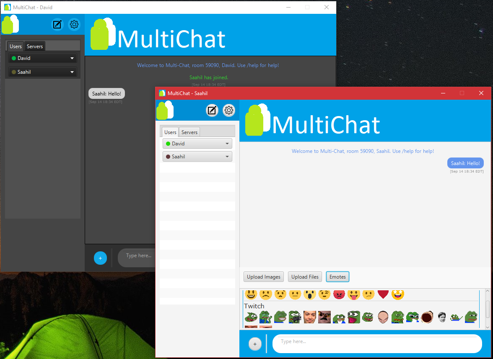
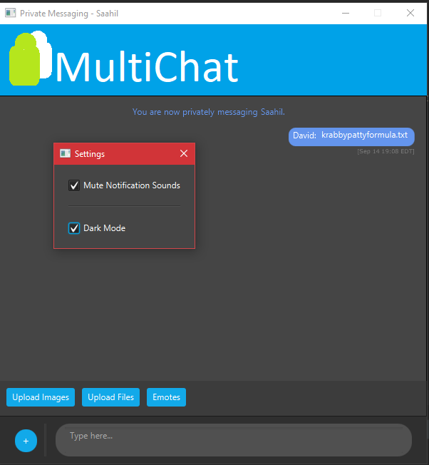
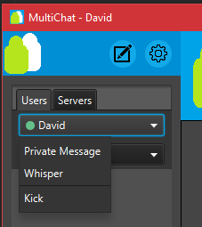
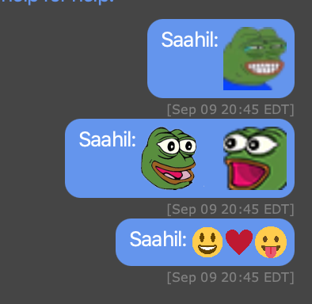
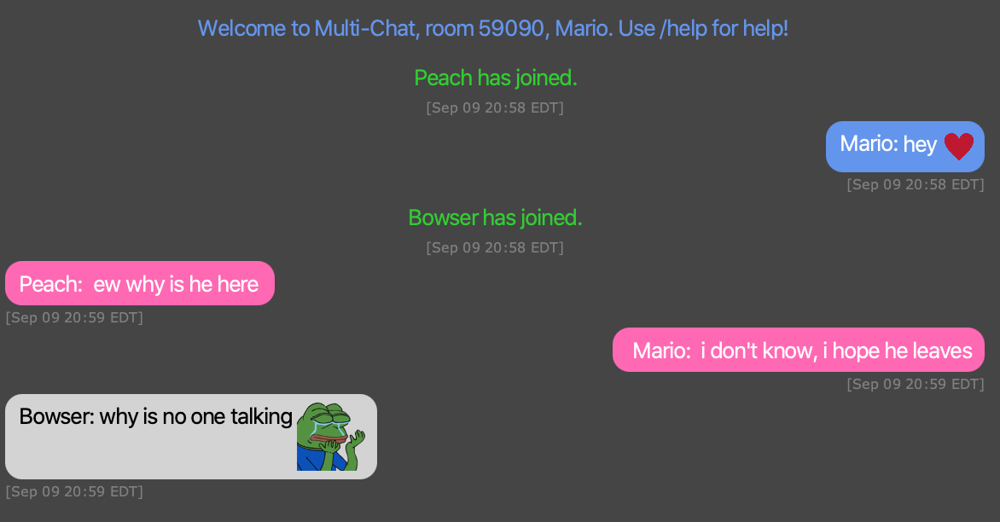
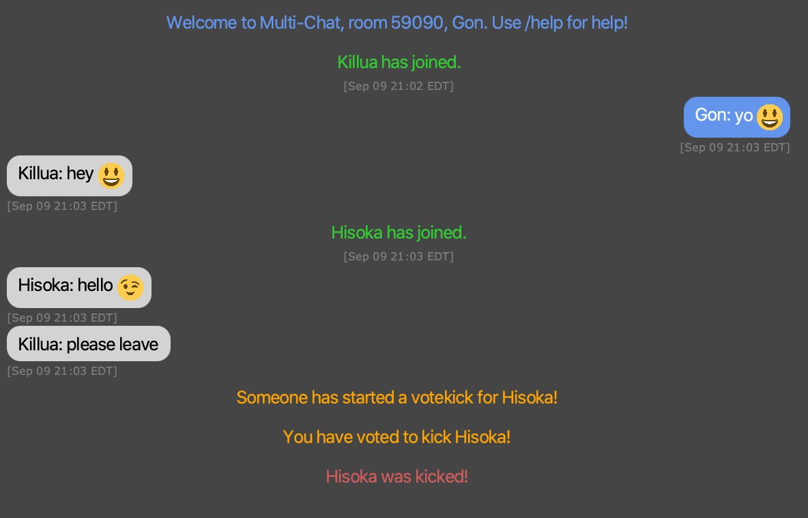
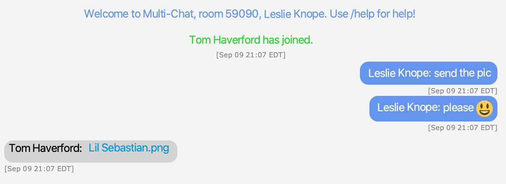
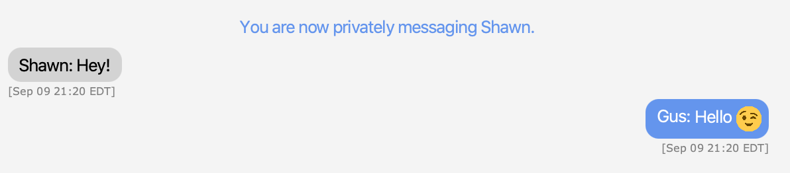

# SSLSocket-Messaging-App
A chatting application with a dedicated GUI client and servers, operating on TLS protocols. 

# MultiChat - A Chatting Application Using Java Sockets
A chatting application with a dedicated GUI client and servers, operating on TLS protocols. MultiChat is a room chatting application with a modern look and features such file transferring, emotes, and private messaging.

## Motivation
This project was an opportunity to learn the server-client model and apply the Object Oriented Programming designs from class. The experimentation and research had some serendipitous lessons such as UI/UX design, the Internet layers, and a newfound appreciation for CSS! Also it helped with the quarantine cabin fever ;p

## Screenshots

## Installation
A guide on how to install MultiChat will be coming soon. 

## Libraries Used
JavaFX is used to provide the GUI view of the client. The Java Swing library was used but is now deprecated. Switching between the JavaFX and Java Swing libraries presented a unique challenge when trying to grab JavaFX instance for the controller object, but was overall painless with the MVC design.

## Features
MultiChat comes with several fun features to make chatting a more enjoyable experience. 

### Emotes
Like many other chatting applications, MultiChat supports the use of emojis in messages. However, what sets MultiChat apart is that it has support for Twitch emotes as well. Emotes such as PepeHands and FeelsGoodMan can be put into messages simply by typing out their name. Gif emotes, such as pepeD, work as well.

If you wish to send an emote without typing its name, you can use the custom emoji keyboard which contains all the emotes supported by MultiChat.

### Whispers
One of the things that makes MultiChat unique is that it grants users the ability to whisper. A whisper is a message that is sent to a group chat but can only be seen by the person receiving the whisper. It's a convenient way of privately sending simple messages while still within a group chat.

### Votekicks
When a user is spamming messages or being rude, a votekick can be used to remove them from the chat. Once a votekick is started, the members of the group chat have 20 seconds to acquire a majority vote. If a majority of the members vote to kick the malicious user out, they will be removed from the chat. 

### Sending Files
MultiChat also supports sending images and files within either a group or private chat. When a file is sent, it appears as a link which can be clicked to save the file locally.

### Private Messaging
While MultiChat is primarily a group-focused chatting application, it still has support for private messaging. When another user privately messages you, a new chat window will pop up and show you their message. 

## Usage

### For the provider
1.) Run MultiChatMasterServer
    This server keeps track of all active MultiChatServers and will update every server when one becomes active or inactive.
2.) Run MultiChatServer (as many instances as you want)
    This server serves the clients and acts as the room for the clients to connect in. Run this with command line arguments specifying the amount of users that can connect to this server (room) and specifying what port to use. There are also basic commands to manage the server while its running in the terminal: receiving the list of all active servers, all active users, and closing the server (removing any client sent files and ending the connection).
3.) Port Foward
    Instruct your route to recognize and route any requests to your specified port to the server.
4.) Construct a .jar file for your clients
    Construct a .jar file for your clients with the arguments specifying the server's public IP address and the port number you want to be the default (welcome) room.

### For the users
1.) Run the .jar file!

